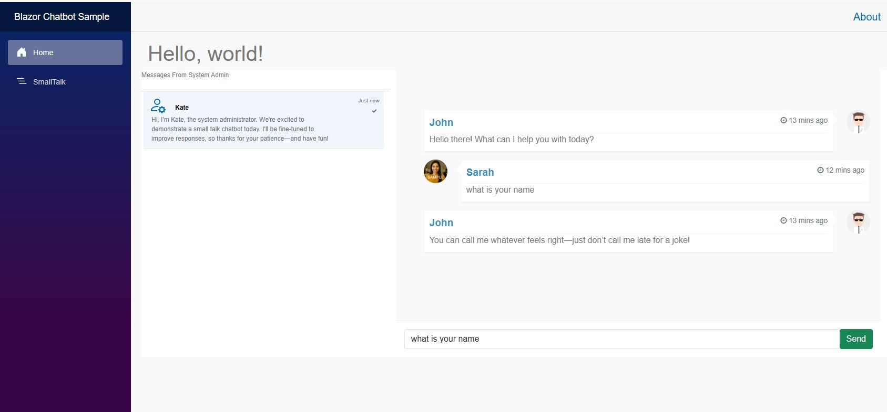

# blazor-sample

It is a Blazor-based chatbot demo designed for light, casual interactions. It showcases conversational AI tuned for friendly exchanges, system announcements, and basic responsiveness. The bot interface blends simplicity with a touch of personality, making it ideal for testing small talk detection and fine-tuning NLP models

<h1>Demo</h1>

